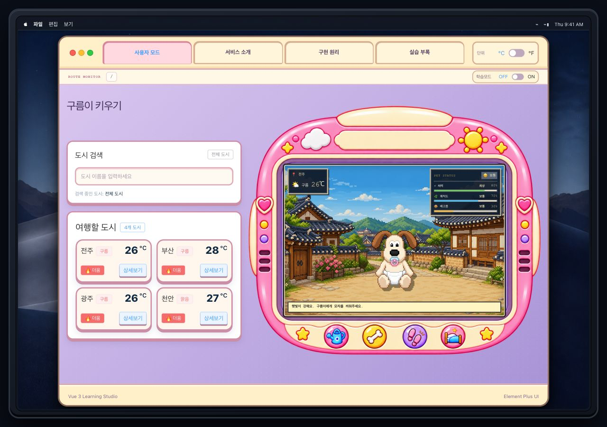

# 학습용 어플리케이션; Weather Pet

- 도시별 날씨와 다마고치형 펫 시뮬레이션을 결합한 Vue 학습 프로젝트입니다.

- 도시를 선택하면 해당 도시의 날씨, 랜드마크 배경, 추천 메시지가 적용됩니다. 

- 시간의 흐름에 따라 펫의 상태가 변하고, 버튼 상호작용으로 도시의 기온과 날씨 조건이 반영됩니다.

- Vue가 어떻게 동작하는지 확인할 수 있도록 `구현 원리`, `학습모드`, `실습 부록`을 함께 구성했습니다.

---

## Problem; Vue 학습자에게 도움이 되는 과제를 만들고 싶었습니다.

### 1. 날씨를 확인하면 사용 흐름이 끝납니다

날씨가 메인 컨텐츠인 애플리케이션의 문제:

```text
도시 선택
→ 날씨 정보 출력
→ 종료
```

과제 구현을 넘어 새로운 학습자에게 도움이 되는 결과를 만들고 싶었습니다.

### 2. 화면 변화와 Vue의 동작 원리가 연결되지 않습니다

완성된 화면만 보면 학습자가 다음 내용을 파악하기 어렵습니다.

- 도시를 클릭했을 때 어떤 이벤트가 발생하는가?
- 데이터가 어디에서 변경되는가?
- 데이터가 바뀌면 왜 화면도 자동으로 변경되는가?
- `ref`, `computed`, `v-for`, `v-if`, Pinia 등의 기능이 실제 애플리케이션에서는 어디에 사용되는가?

### 3. 수업 실습이 여러 파일로 흩어져 있습니다

수업 중 작성한 Vue 실습 코드가 전부 import 된 것이 아니기 때문에, 수업 이후 필요한 개념을 다시 찾아보고 싶었습니다.

---

## Solution; 대중적인 '다마고치'게임을 메인컨텐츠로 자연스럽게 Vue를 학습할 수 있도록 설계하였습니다.

### 1. Weather + Pet

날씨 확인에서 끝나는 흐름을 펫의 환경 변화와 돌봄 경험으로 확장했습니다.

```text
도시 선택
→ 도시별 픽셀 배경 변경
→ 날씨 정보와 추천 메시지 적용
→ 사용자 돌봄 행동 또는 시간 경과
→ Pinia의 펫 상태 변경
→ 게이지·메시지·캐릭터 갱신
```

예를 들어 비가 오는 도시에서는 실내 휴식을 추천하며, 비가 많이 오거나 대기질이 나쁜 도시에서 산책하면 체력이 더 감소합니다. 펫의 체력·쾌적도·배고픔은 돌봄 행동과 10초 주기의 시간 변화에 따라 갱신됩니다.

### 2. 학습모드

사용자 모드에서 학습모드 토글을 켜면 검색, 도시 목록, 펫 화면, 상태 게이지, 돌봄 행동에 사용된 Vue 개념을 확인할 수 있습니다.

예시:

```text
도시 카드 클릭
→ @click
→ selectedCity 변경
→ 도시 정보가 PetStage에 props로 전달
→ 표시 온도·메시지 등 computed 재계산
→ 배경·날씨·메시지 갱신
```

각 학습 포인트에서 사용 개념, 현재 반응형 데이터, 데이터 흐름, 관련 코드를 함께 확인할 수 있도록 구성했습니다.

### 3. 구현 원리

`구현 원리` 페이지에서는 Weather Pet 전체의 동작 과정을 Vue 관점에서 설명합니다.

단순한 Vue 문법 설명이 아니라 도시 선택과 펫 돌봄이라는 두 상태 흐름을 실제 프로젝트 코드를 기준으로 확인할 수 있습니다.

```text
도시 선택
→ selectedCity 변경
→ 도시 정보·메시지 갱신

돌봄 행동 또는 시간 경과
→ Pinia 상태 변경
→ computed로 상태 라벨·캐릭터 계산
→ 펫 화면 갱신
```

### 4. 실습 부록

수업 중 작성했던 Vue 실습 파일을 한 곳에서 다시 실행할 수 있도록 구성했습니다.

기존 Component Launcher 방식을 활용하여 `v-for`, `v-if`, `v-bind`, Event, `v-model` 등 수업 중 진행했던 48개 실습을 다시 확인할 수 있습니다.

---

## Project Structure

```text
src/
├── components/
│   ├── exercise/         # 날씨 검색, 도시 카드 등 사용자 화면 컴포넌트
│   ├── pet/              # 펫 화면, 상태 및 돌봄 기능
│   ├── learning/         # 학습모드 설명 UI
│   └── practices/        # 수업 실습 코드 48개
│
├── views/
│   ├── WeatherHomeView.vue        # 사용자 모드
│   ├── WeatherAboutView.vue       # 서비스 소개
│   ├── LearningView.vue           # 구현 원리
│   ├── PracticeAppendixView.vue   # 실습 부록
│   └── WeatherDetailView.vue      # 도시별 상세 날씨
│
├── data/                 # 날씨 Mock Data와 학습 포인트
├── services/             # OpenWeatherMap API 연동
├── stores/               # Pinia 전역 상태
├── router/               # Vue Router
├── App.vue
└── main.js
```

## Page Structure

```text
/
└─ 사용자 모드

/about
└─ 서비스 소개

/how-it-works
└─ 구현 원리

/practice
└─ 실습 부록

/weather/:cityId
└─ 도시별 상세 날씨
```

프로그램 내부의 Route Monitor를 통해 현재 Vue Router 경로를 함께 확인할 수 있도록 구성했습니다.

## Tech Stack

- Vue 3
- Vue Router
- Pinia
- Axios
- Element Plus
- Vite
- OpenWeatherMap API

## Getting Started

### Requirements

- Node.js `20.19.0` 이상 또는 `22.12.0` 이상

### Install

```sh
npm install
```

### Development

```sh
npm run dev
```

### Build

```sh
npm run build
```

## Weather API

실시간 날씨 정보를 사용하려면 `.env.example`을 복사해 `.env` 파일을 만들고 OpenWeatherMap API 키를 입력합니다.

```sh
cp .env.example .env
```

```env
VITE_OPENWEATHER_API_KEY=your_openweathermap_api_key
```

API 키가 있으면 메인 화면의 기온, 짧은 날씨 상태, 습도, 풍속, 날씨 아이콘을 OpenWeatherMap 응답으로 갱신합니다. OpenWeatherMap의 자세한 날씨 설명은 도시 카드의 `상세보기`에서 확인할 수 있으며, 해당 화면에서 [5 Day / 3 Hour Forecast API](https://openweathermap.org/forecast5)와 [Air Pollution API](https://openweathermap.org/api/air-pollution)를 추가로 호출합니다.

상세 페이지는 3시간 간격 예보를 날짜별 최저·최고 기온과 최대 강수확률로 집계하고, 현재 AQI와 PM2.5·PM10·NO₂·O₃ 농도를 함께 표시합니다. 랜드마크와 펫 추천 메시지는 프로젝트의 기본 데이터를 유지합니다.

API 키가 없거나 현재 날씨 요청이 실패하면 기본 도시 데이터를 사용하고, 예보·대기질 중 일부 요청만 실패하면 해당 패널에만 오류 안내를 표시합니다. `.env` 파일과 실제 API 키는 Git에 커밋하지 않습니다.

## External UI Library

이 프로젝트는 [Element Plus](https://element-plus.org/)를 외부 UI 라이브러리로 사용합니다.

메뉴, 카드, 태그, 입력창, 알림, 진행률 표시 및 레이아웃 요소에 적용했습니다.

## 단원별 Customization 기록

### Vue Syntax · Weather Mockup

- 서울·수원·부산 예제를 전주·부산·광주·천안 여행 데이터로 확장했습니다.
- 기온 조건 라벨, 한글 도시 검색, 카드 선택, `.stop`을 사용한 상세보기를 구현했습니다.
- 도시별 랜드마크, 픽셀 배경, 펫 추천 메시지를 추가하고 실제 화면 변화에 연결했습니다.

### Composition API

- `ref`로 검색어·선택 도시·날씨 목록을 관리하고 `computed`로 한글 검색 결과를 필터링했습니다.
- `watchEffect`로 검색어 변화를 추적하고, `watch`로 검색 쿼리·선택 도시·펫 상태를 학습 패널과 동기화했습니다.
- 검색 전·검색 성공·결과 없음 상태를 각각 표시하도록 확장했습니다.

### Vue Components

- 검색과 도시 목록을 `BaseDashboardCard` 슬롯으로 공통화하고 `SearchBar`, `WeatherCard`를 props·emits 기반으로 분리했습니다.
- 도시 배경, 펫 상태, 돌봄 행동을 담당하는 `PetStage`와 상태 컴포넌트를 추가했습니다.

### Vue Router

- 상세보기를 alert 대신 `/weather/:cityId`로 이동하는 동적 라우팅으로 변경했습니다.
- 서비스 소개, 구현 원리, 실습 부록, 404 페이지와 Route Monitor를 추가했습니다.

### Pinia

- `configStore`로 섭씨·화씨 단위를 관리하고 메인·상세 날씨와 5일 예보에 동일하게 적용했습니다.
- `petStore`를 추가해 체력·쾌적도·배고픔·기분을 관리하고, 돌봄 행동과 10초 주기 변화를 화면에 반영했습니다.

### Axios · OpenWeatherMap

- 현재 날씨를 도시 카드와 펫 화면에 적용하되, 긴 상세 설명은 도시 상세 페이지에서만 확인하도록 분리했습니다.
- 5일/3시간 예보와 대기오염 API를 추가해 날짜별 기온·강수확률과 AQI·오염물질 농도를 상세 페이지에 표시했습니다.
- API 없음·전체 실패·일부 실패를 구분해 기본 데이터와 패널별 오류 안내를 제공했습니다.

### External UI Library

- Element Plus를 전역에 적용하고 메뉴, 카드, 태그, 입력, 알림, 로딩, 스위치를 프로젝트 디자인에 맞게 조정했습니다.

### Build · Deployment

- ESLint·Oxlint 오류를 제거하고 Vite 프로덕션 빌드가 완료되도록 구성했습니다.
- API 키는 환경변수로 분리하고 README에 실행·API 연결 방법과 최신 화면을 기록했습니다.

## Troubleshooting

### 반응형 화면에서 콘텐츠가 잘리는 문제

**문제**
375px와 768px 화면에서 제목이 검색 영역과 겹치고 펫 화면 일부가 푸터에 가려졌습니다.

**원인**
전체 애플리케이션은 고정된 데스크톱 화면을 비율에 맞게 축소하고 있었지만, 내부 미디어 쿼리가 콘텐츠를 다시 1열로 배치해 높이가 늘어났습니다.

**해결**
`WeatherHomeView`와 `PetStage`의 내부 모바일 재배치 규칙을 제거하고, 전체 화면이 동일한 비율로 축소되도록 구성했습니다.

**결과**
375px, 768px, 1280px 환경에서 콘텐츠의 순서와 화면 계층이 유지되고 푸터 잘림이 사라졌습니다.

### 상세보기 버튼에서 카드 선택까지 실행되는 문제

**문제**
도시 카드의 `상세보기` 버튼을 누르면 상세 페이지 이동과 부모 카드의 도시 선택 이벤트가 함께 실행됐습니다.

**원인**
버튼의 클릭 이벤트가 부모 카드까지 버블링됐습니다.

**해결**
상세보기 이벤트에 Vue의 `.stop` 이벤트 수식어를 적용했습니다.

**결과**
도시 선택과 상세 페이지 이동이 서로 독립적으로 동작하게 됐습니다.

### 화면마다 온도 단위가 다르게 표시되는 문제

**문제**
섭씨·화씨 전환 상태를 컴포넌트별로 관리하면 메인 카드, 펫 화면, 상세 화면의 단위가 서로 달라질 수 있었습니다.

**원인**
여러 컴포넌트가 동일한 설정을 각자 관리하는 구조였습니다.

**해결**
Pinia의 `configStore`를 단일 상태 저장소로 사용하고 공통 온도 변환 함수를 적용했습니다.

**결과**
한 번의 단위 변경이 도시 카드, 펫 화면, 상세 날씨와 5일 예보에 동일하게 반영됩니다.

### 네비게이션 영역이 복잡해지는 문제

**문제**
단위 토글과 학습모드 토글이 상단 네비게이션바에 함께 배치되어 메뉴가 답답하고 각 기능의 역할이 구분되지 않았습니다.

**원인**
용도가 다른 두 설정을 동일한 시각적 계층에 배치했습니다.

**해결**
단위 토글은 상단 네비게이션바에 유지하고, 학습모드 토글은 아래의 Route Monitor 영역으로 분리했습니다.

**결과**
네비게이션바가 간결해지고 전역 표시 설정과 학습 보조 기능의 역할이 명확해졌습니다.
